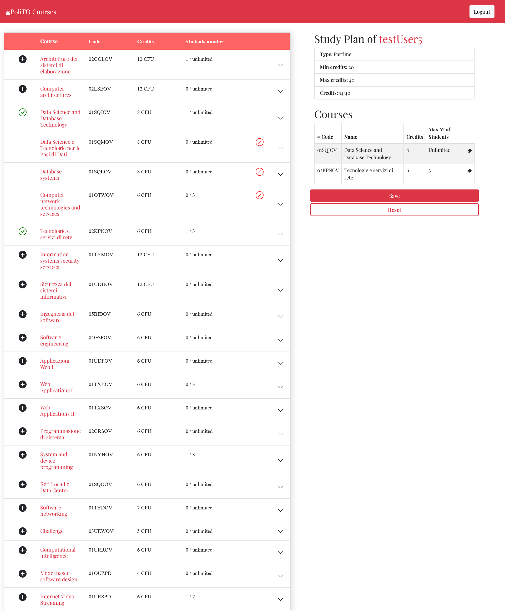

# Exam #1: "Piano degli studi"
## Student: s304140 De Venuto Stefano 

## React Client Application Routes

- Route `/`: shows the whole list of courses, along with the current study plan if the user is logged. It acts as the homepage of the application. 
- Route `/edit`: shows the current Study Plan, along with the inserted courses, and the list of courses. It permits to add the various courses to the study plan, accordingly with the pre set constraints.
- Route `/login`: shows the login form. It permits to be enrolled in the login process

## API Server

### User
#### __Get current user__
- GET `/api/user/current`
- Get the information of currenttly logged user 
- Request body: _None_
- Response: `200 OK` An object containing the User info
```
{
    "id": 1,
    "email": "testUser1@mail.com",
    "name": "testUser1",
}
```
- Error response: `401 Unauthorized` (Not authenticated), `503 Service Unavailable` (Unexpected error)

#### __Login__
- POST `/api/user/login`
- Performs the login process  
- Request body: An object containing the user credentials
```
{
    "email": "testUser1@mail.com",
    "password": "testPassword1"
}
```
- Response: `200 OK`
- Error response: `401 Unauthorized` (Wrong credentials), `503 Service Unavailable` (Unexpected error)

#### __Logout__
- POST `/api/user/logout`
- Performs the logout process  
- Request body: _None_
- Response: `200 OK`
- Error response: `503 Service Unavailable` (Unexpected error)

### Courses
#### __List All Courses__
- GET `/api/course/`
- Get all the courses inside the database
- Request body: _None_
- Response: `200 OK` An array of objects, each describing a course
```
[
    {
        "code": "02GOLOV",
        "name": "Architetture dei sistemi di elaborazione",
        "credits": 12,
        "maxStudents": null,
        "propedeuticCourse": null,
        "incompatibleCourses": [
            "02LSEOV"
        ],
        "currentStudents": 0
    },
    {
        "code": "02LSEOV",
        "name": "Computer architectures",
        "credits": 12,
        "maxStudents": null,
        "propedeuticCourse": null,
        "incompatibleCourses": [
            "02GOLOV"
        ],
        "currentStudents": 1
    },
...
]
```
- Error response: `500 Internal Server Error` (generic error)

#### __Get a Course by ID__
- GET `/api/course/:courseId`
- Get the course identified by the id `:courseId`.
- Request body: _None_
- Response: `200 OK` An object, describing a course
```
{
    "code": "02GOLOV",
    "name": "Architetture dei sistemi di elaborazione",
    "credits": 12,
    "maxStudents": null,
    "propedeuticCourse": null,
    "incompatibleCourses": [
        "02LSEOV"
    ],
    "currentStudents": 0
}
```
- Error response: `401 Unauthorized` (Not authenticated), `500 Internal Server Error` (generic error)

### Study Plan
#### __Get Study Plan__
- GET `/api/studyPlan/`
- Get the Study Plan of the currently logged in User.
- Request body: _None_
- Response: `200 OK` An object, describing a study plan, along with its courses
```
{
    "id": 85,
    "type": "PARTIME",
    "owner": 1,
    "courses": [
        {
            "code": "02GOLOV",
            "name": "Architetture dei sistemi di elaborazione",
            "credits": 12,
            "maxStudents": null,
            "propedeuticCourse": null,
            "incompatibleCourses": [
                "02LSEOV"
            ],
            "currentStudents": 1
        },
        ...
    ]
}
```
- Error response: `401 Unauthorized` (Not authenticated), `500 Internal Server Error` (generic error)

#### __Create Study Plan__
- POST `/api/studyPlan/`
- Create a Study Plan for the currently logged in User.
- Request body: the type (frequency) and the list of courses to be inserted
```
{
    "type": "PARTIME",
    "courses": [
        "02GOLOV",
        "01SQJOV"
    ]
}
```
- Response: `200 OK`
- Error response: `401 Unauthorized` (Not authenticated), `422 Unprocessable Entity` (Number of credits excedeed OR Conflicts in proedeutic courses OR Conflicts in incompatible courses OR Course already inserted OR Max students reached),  `404 Not Found` (Inexistent course), `500 Internal Server Error` (Unexpected error)

#### Delete Study Plan
- DELETE `/api/studyPlan/`
- Deletes the Study Plan of the currently logged in User  
- Request body: _None_
- Response: `200 OK`
- Error response: `503 Service Unavailable` (Unexpected error)

## Database Tables

- Table `user` - contains the user information<br>
  __Fields__: id, email, name, password, salt
- Table `course` - contains the courses<br>
  __Fields__: code, name, credits, propedeuticCourse, currentStudents, maxStudents
- Table `incompatibleCourses` - list of incompatible courses<br>
  __Fields__: firstCourse, secondCourse
- Table `studyPlan` - contains the study plan information<br>
  __Fields__: id, type, user
- Table `studyPlan_course` - contains the list of courses inside a studyPlan<br>
  __Fields__: studyPlan. course

## Main React Components

- `Homepage` (in `Homepage/components.js`): shows the whole homepage of the application, with just the courses in case of un-logged in user and courses and study plan in case of logged in one. 
- `StudyPlan` (in `StudyPlan/components.js`): shows the study plan info and the list of courses associated, if already created, otherwise the choice between study plan types.
- `CourseList` (in `Course/components.js`): shows the list of courses, along with the ability to add a course to the study plan if the current user is logged in and has a study plan
- `CustomNavbar` (in `Navbar/components.js`): top bar, visible in every page, which encapsulates the functionalities of login, logout, modifying a study plan and deleting a study plan
- `LoginForm` (in `Login/components.js`): shows the form used to submit a new login request. It prevents the use from entering invalid emails and shows a specific error in case of invalid credentials

## Screenshot

### Create Study Plan


## Users Credentials

| email              | password | name      |
|:-------------------|:---------|:----------|
| testUser1@mail.com | password | testUser1 |
| testUser2@mail.com | password | testUser2 |
| testUser3@mail.com | password | testUser3 |
| testUser4@mail.com | password | testUser4 |
| testUser5@mail.com | password | testUser5 |
